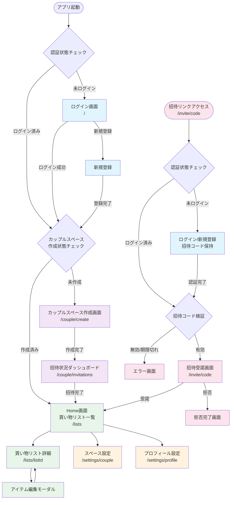

# 画面遷移設計

## 概要
このドキュメントでは、認証状態とカップルスペース作成状態に基づいた画面遷移を定義します。
アプリケーションは以下の3つの主要な状態に基づいて適切な画面へユーザーを誘導します。

1. **未ログイン状態**: ログイン画面へ遷移
2. **ログイン済み + カップルスペース未作成**: カップルスペース作成画面へ遷移
3. **ログイン済み + カップルスペース作成済み**: Home画面（買い物リスト一覧）へ遷移

## 画面遷移フロー図



## 詳細な遷移パターン

### 1. 初回ユーザーの通常フロー
```
アプリ起動
  → 未ログイン検知
  → ログイン画面 (/)
  → 新規登録
  → カップルスペース作成画面 (/couple/create)
  → カップル作成 & 招待送信
  → 招待状況ダッシュボード (/couple/invitations)
  → Home画面 (/lists)
```

### 2. 招待を受けたユーザーのフロー
```
招待リンククリック (/invite/[code])
  → 未ログイン検知
  → ログイン/新規登録（招待コード保持）
  → 招待コード検証
  → 招待受諾画面 (/invite/[code])
  → 受諾
  → Home画面 (/lists)
```

### 3. 既存ユーザーの再訪問フロー
```
アプリ起動
  → ログイン済み検知
  → カップルスペース作成済み検知
  → Home画面 (/lists)
```

### 4. カップルスペース作成済みユーザーが招待を受けた場合
```
招待リンククリック (/invite/[code])
  → ログイン済み検知
  → 既存カップルスペース存在検知
  → エラー画面（既に別のカップルスペースに参加済み）
```

## 実装上の注意点

### ミドルウェア設計
Next.js 15のミドルウェアで以下のチェックを実装：

1. **認証チェック** (`middleware.ts`)
   - Supabase Authのセッション確認
   - 未認証の場合はログイン画面へリダイレクト
   - 公開ページ（`/invite/[code]`）は例外

2. **カップルスペースチェック**
   - `couple_partners` テーブルで所属チェック
   - 未所属かつ `/couple/create` 以外へのアクセス時はカップル作成画面へリダイレクト
   - 招待受諾フローは例外処理

3. **招待コード検証**
   - `partner_invites` テーブルで有効性確認
   - 期限切れ、既受諾、存在しないコードの処理

### ルートガード実装例
```typescript
// 保護されたルートのガード
const protectedRoutes = ['/lists', '/settings/*'];
const authRoutes = ['/'];
const onboardingRoutes = ['/couple/create', '/couple/invitations'];
const publicRoutes = ['/invite/*'];

// 優先順位
// 1. publicRoutes: 認証不要
// 2. 未認証 → authRoutes
// 3. カップル未作成 → onboardingRoutes
// 4. それ以外 → protectedRoutes
```

### リダイレクトロジック
```typescript
// 認証後のリダイレクト先決定
async function getRedirectPath(userId: string): Promise<string> {
  const couplePartner = await prisma.couple_partners.findFirst({
    where: { profile_id: userId, status: 'active' }
  });

  if (!couplePartner) {
    return '/couple/create';
  }

  return '/lists';
}
```

### 招待リンクの状態管理
```typescript
// 招待リンクアクセス時の処理
// 1. コード検証
// 2. 認証状態確認
// 3. 既存カップルスペース確認
// 4. 適切な画面へ誘導
async function handleInviteLink(code: string, session: Session | null) {
  const invite = await validateInviteCode(code);

  if (!invite.valid) {
    return '/invite/error';
  }

  if (!session) {
    // 招待コードをセッションストレージに保存
    return `/login?redirect=/invite/${code}`;
  }

  const existingCouple = await checkUserCouple(session.user.id);

  if (existingCouple) {
    return '/invite/already-member';
  }

  return `/invite/${code}`;
}
```

## 関連ドキュメント
- [画面構成案](screen-architecture.md): 各画面の詳細仕様
- [データモデル設計](data-model.md): カップル・招待関連のテーブル設計
- [実装計画](implementation-plan.md): 画面遷移の実装タスク
